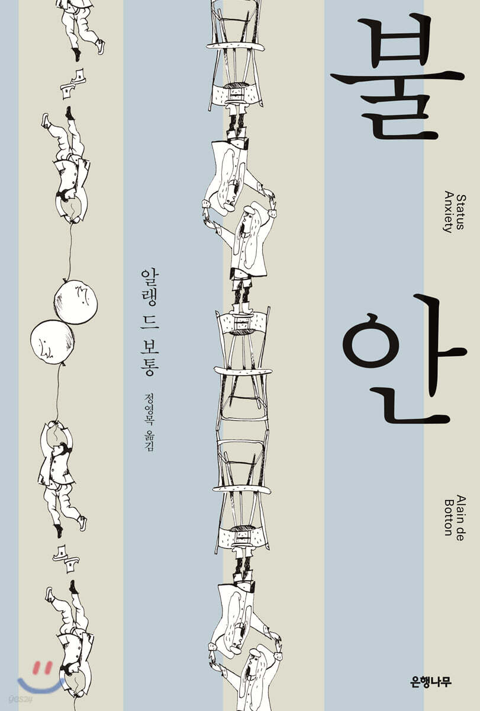

요즘 독서모임 내에서 무엇을 읽으면 좋을지 고민이 많았다.
문듯 많은 사람들에게 알려진 유명한 책들(고전 책, 서점 베스트, 하버드에서 추천하는 100가지 등)을 하나씩 읽어보는 것도 좋은 방법이라고 생각했다.
무엇이 있나 고민하다 이전에 `알랭 드 보통 - 왜 나는 너를 사랑하는가`를 읽어 보았는데 좋았던 기억이 있다.
알래 드 보통도 유명한 작가이기도 하고 말이다.

그래서 그의 책 [불안]((https://product.kyobobook.co.kr/detail/S000000828225))을 추천했고 34번째 독서모임 책으로 읽게 되었다.


알랭 드 보통이 정의하는 불안은 **지위**와 관련이 있다.
먼저 책에서 말하는 **지위**를 정의해보면 다음과 같다.

### 정의

- 사회에서 사람이 차지하는 위치, 지위(status)는 **신분**이라는 뜻의 라틴어 statum 에서 파생되었다.
- 좁은 의미로 한 집단 내의 법적 또는 직업적 신분을 가리킨다.
- 그러나, 더 넓은 의미에서는 **세상의 눈으로 본 사람의 가치나 중요성을 가리키며**, 이 책에서는 이 의미가 더 중요하다.

책의 구성은 쉽게 되어 있었다.
원인 파트와 해법 파트 두가지고 나뉘어져 있었다.

### 원인

1. **사랑결핍**

- 사랑 받고 싶은 욕망이 지위 추구로 연결 됨

2. **속물근성**

- 사람을 직업, 연봉, 배경으로 평가
- 사람보다 지위를 보는 시선이 불안을 부추김

3. **기대**

- 과거에는 계급이 있었기에 올라갈 수 있다는 기대수준이 낮았음
- 기회가 평등해져 기대 수준이 높아졌음

4. **능력주의**

- 실패가 개인의 책임으로 귀속되어 자존감 하락, 불안을 부추김

5. **불확실성**

- 외부에 의존하는 삶은 언제나 흔들릴 수 밖에 없음

### 해법

1. **철학**

- 외부 기준보다 내면의 기준으로 삶을 평가하라고 함

2. **예술**

- 인간의 다양한 삶을 보여주는 거울 역할
- 다른 사람들의 고통, 실패, 다양성을 통해 나 자신을 수용할 수 있게 도와줌

3. **정치**

- 제도적 개선, 복지 확대를 통해 사회적 안정망 설치

4. **기독교**

- 종교는 인간을 조건없는 존엄한 존재로 바라봄
- 지위와 상관없이 사랑과 용서를 강조함
- FYI) 근데 기독교인이 아님

5. **보헤미아**

- 주류 가치에 반기 들기

### 느낀점

불안은 세대를 거듭 할 수록 깊어지고 싶해지고 있다.
원래는 마을, 조금 더 확장해 봤자 지역, 조금 더 확장해 봤자 나라에서 비교하였다.
그러나 글로벌 세계가 되면서 이제는 전세계 사람들과 비교하게 되었다.
나도 모르는 사이에 전세계 사람들과 비교하여 그들보다 더 잘 먹고 잘 살고 싶은 마음이 커졌다.
이러한 마음이 불안을 확대 시켰다.
불안이 가지는 부정적인 면이 지금의 내게는 더 크게 와닿았다.

그래서 해법에서 이러한 불안을 어떻게 대처할 수 있게 할지 기대하게 되었다.
많은 부분 도움이 될 수 있겠다고 생각했고 해법을 읽으면 느꼈던 두가지 마음이 있었다.

#### 첫번째, 대자연에 대한 내용이었다.

사람들은 주변에 있는 고만고만한 것들 끼리 비교하기 때문에 해볼 만 하겠는데(?)와 같은 마음이 든다.
그러나 대자연 앞에 서면 나는 너무나 작고 한없는 존재임을 직시하게 된다.
유튜브에서 여러 사람들이 자연을 탐험하고 느끼는 점들을 들어보면 자연에 비해 나는 작고 한없는 존재이구나 라고 말하는 걸 몇 번 보았다.

나도 전에 한라산에 등반한 적이 있는데 위와 같은 마음이 조금 느껴졌었다.
그냥 내가 할 수 있는 것은 한걸음씩 정상을 향해 나아가는 것 뿐이였다.
할 수 있는 최선을 다하는 것이 전부이자 내가 해야할 일이라고 느꼈다.
이러한 마음이 불안을 없애는 데 의외의 도움이 되었다.


#### 두번째, 책에서는 나와있는 내용은 아니지만 읽으면서 계속 느꼈던 마음이다.

내가 살아가는 이유에 대해 근본적인 질문을 던지는 것이다.

```
왜 높은 지위에 올라가고자 하는 마음이 있을까?
```

각자 조금씩은 다르겠지만 어찌되었든 행복하게 살려고 하는 것 아닌가 싶다.
그런데 행복하려고 더 많이 벌고 승진하려는 마음이 어쩌면 행복하지 않는 삶을 살게 한다는 생각이 들었다.

가끔은 욕심을 부려야 할 때도 있을 것이다.
그러나 가끔은 욕심을 내려놓고 나를 돌아보고, 가족을 보고, 더 여유가 있다면 이웃을 바라보아야 하지 않을까 싶다.

요즘 마음 속 불안이 큰 시점에 이 책을 만나게 되어 큰 행운이었다.
사실 내용이 조금 어려워서 전체적인 흐름만 보았고 세세히 이해하지는 못하였다.
그래도 마음의 울림이 되기에는 충분했던 책이었다.
