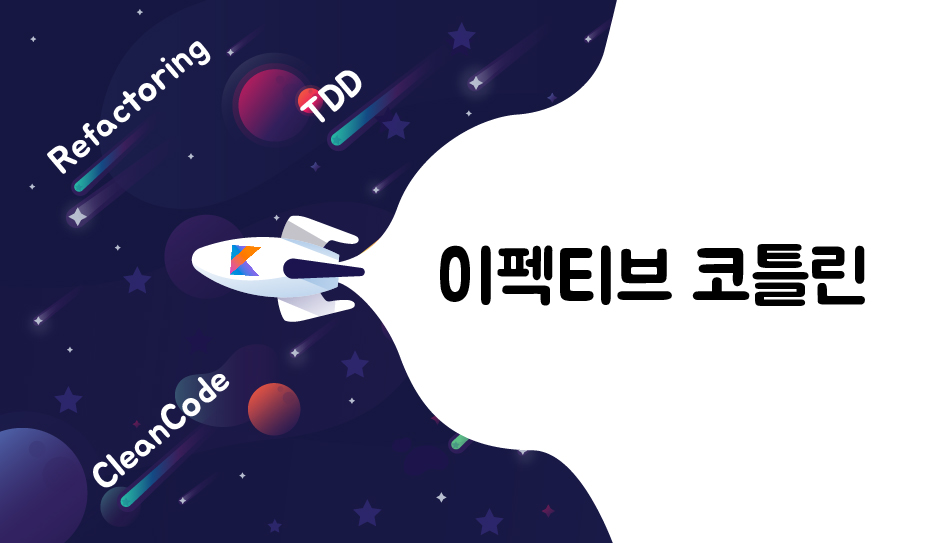
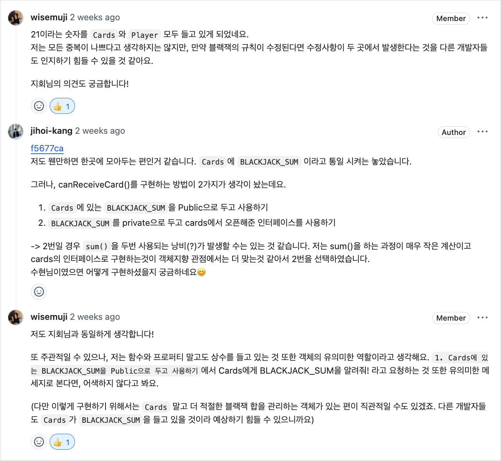
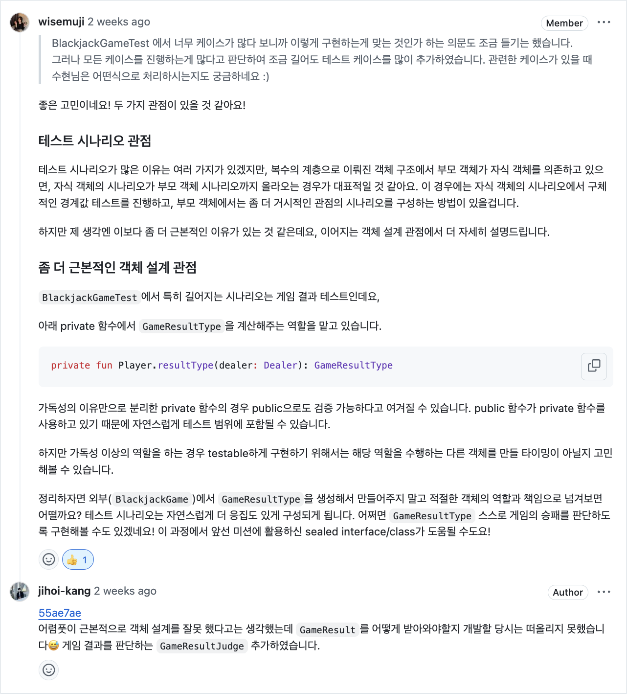
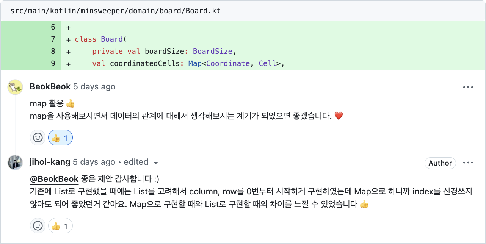
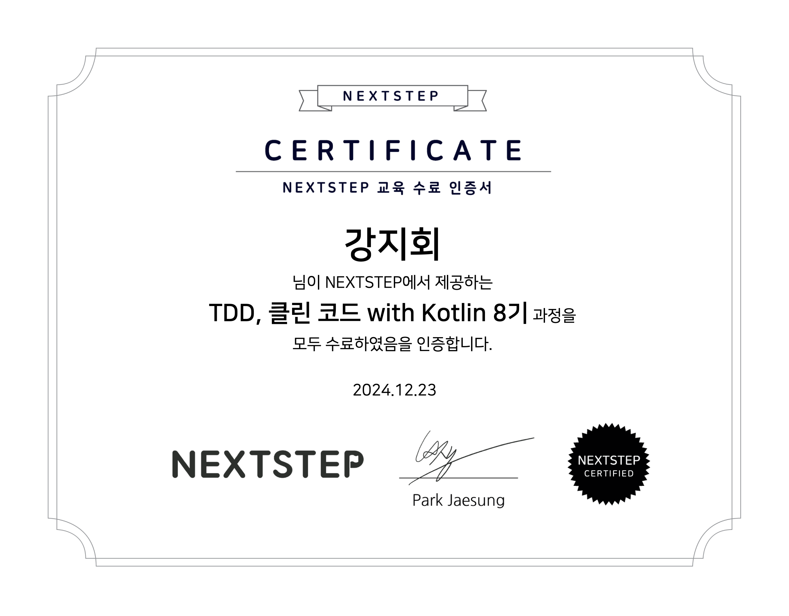

예전부터 NEXTSTEP 교육을 알고는 있었지만, 꽤 비싼 수강료 때문에 선뜻 시작하지 못하였다.
그러다 우연히 [학습 테스트로 배우는 Compose](https://edu.nextstep.camp/c/7OfwiPCo)를 수강하게 되었다.
그 당시 Android Compose를 시작한지 얼마 되지 않아서 학습과 검증이 필요하다고 생각했다.

Compose 강의를 통해서 많은 도움을 받게 되었고 너무 만족스러워 다른 강의도 찾게 되었다.
찾아보던 중 [TDD, 클린 코드 with Kotlin](https://edu.nextstep.camp/c/Z9QeJlCi) 강의를 발견하게 되었고 이번에 수강하게 되었다.

NEXTSTEP 교육의 가장 큰 특징은 개개인 코드 리뷰를 통해 심도 있는 피드백을 주는 방식이라는 점이다.
내가 이 교육을 좋아하는 이유이다.
평소 다른 사람들과 심도있는 피드백을 주고 받을 기회가 적다 보니 프로그래밍 습관과 사고 방식이 점점 굳어지지 않을까 걱정하였었다.
내가 가지고 있는 코드 철학, 지식을 리뷰어들과 나누면서 맞는지 검증하고, 고민 해볼법한 주제들도 들을 수 있어서 너무 좋았다.
또 내 코드가 다른 사람들에게 어떻게 읽히고 해석되는지 알게 되어 명확하고 유지보수 하기 쉬운 코드를 작성하는데 도움이 되었다.

### 코드 리뷰

코드 리뷰를 통해 단순히 기능 구현에 만족하는 수준을 넘어 더 나은 코드 품질과 설계에 대해 고민 할 수 있었다.
몇가지 리뷰 받은 내용들을 소개해보겠다.

`BLACKJACK_SUM`이라는 변수가 처음에는 `Cards`와 `Player` 두 객체에서 들고 있었다.
변수 중복에 대한 부분과 객체의 인터페이스 관점에 대해 고민해볼 거리를 던져주셔서 의견을 나누었다.

테스트 코드를 작성하면서 이질감이 느껴지는 부분에 대해서 말씀드렸는데 속시원하게 답변해주셨다.
잘못 설계된 부분을 리팩토링할 수 있었고 리팩토링 후 이질감이 사라진걸 느낄 수 있었다.

데이터를 `List`로 관리할 때와 `Map`으로 관리할 때의 장단점을 느낄 수 있었다.
`List`로 구현하면 `View`에서 그려내기가 쉬운데 비지니스 로직을 작성할 때에 이질감이 있었다.
왜냐하면 0번 index부터 시작하기 때문이다.
반면 `Map`으로 구현할 때에는 비지니스 로직에 집중 할 수 있었다.

### 코드 리뷰 리드백 모음

1. [자동차 경주 미션](https://github.com/next-step/kotlin-racingcar/pulls?q=is%3Aclosed+author%3Ajihoi-kang)
2. [로또 미션](https://github.com/next-step/kotlin-lotto/pulls?q=is%3Aclosed+author%3Ajihoi-kang)
3. [블랙잭 미션](https://github.com/next-step/kotlin-blackjack/pulls?q=is%3Aclosed+author%3Ajihoi-kang)
4. [지뢰 찾기 미션](https://github.com/next-step/kotlin-minesweeper/pulls?q=is%3Aclosed+author%3Ajihoi-kang)

### 회고

미션들을 수행하는 거 자체는 어렸지 않았다.
그런데 요구사항을 미리 적는 부분은 좀 어려웠다.
다른 사람들이 미션 수행하는 걸 보니 이미 머리 속에 프로그램이 그려져 있는 것처럼 요구사항이 딱딱 정리되어 있고, 심지어 어떤 객체가 필요하고 각 객체에 어떤 인터페이스 혹은 프로퍼티가 있어야 하는지 명확하게
정의되어 있었다.

나는 만들기 전에 정확하게 어떤 객체들이 필요하고 어떤 인터페이스들이 필요한지 파악하기가 어려웠다. 
나는 객체 프로그래밍을 설계할 때에는 클라이언트측 입장에서 어떻게 호출하고 사용할 건지를 고민한다.
인터페이스부터 명확하게 정의되면 필요한 프로퍼티, 멤버 변수 등은 자연스럽게 구현할 수 있게 된다.
이를 Bottom Up 구현 및 설계이라고 하는데 일단 구현하고 지속적인 리팩토링을 통해서 객체의 역할, 책임, 협력을 찾아 나가면서 설계를 개선해 나가는 접근 방식이다.

반대 개념은 Top Down 개념이다.
전체적인 설계의 방향과 흐름을 결정한 후에 구현을 시작하는 접근 방식이다.
내가 어려워했던 부분이다.
지뢰 찾기 미션 마지막 스탭에서 모든 코드를 지우고 다시 구현하는 미션이 있었는데 이때 조금 Top Down 설계 및 구현을 경험해보았다.

미션을 하면서 어떤 프로그램 요구사항이 있어도 객체 설계를 잘 할 수 있을 것 같은 자신감이 생겼다.
객체 프로그래밍을 객체 프로그래밍 답게 개발할 수 있을 것 같다.
이번 스터디에서 배운 것을 실무에 지속적으로 적용하여 더 복잡한 도메인 설계에도 도전해볼 것이다.

마지막으로, 모든 미션을 끝까지 해낼 수 있어 성취감도 느낄 수 있었다.
