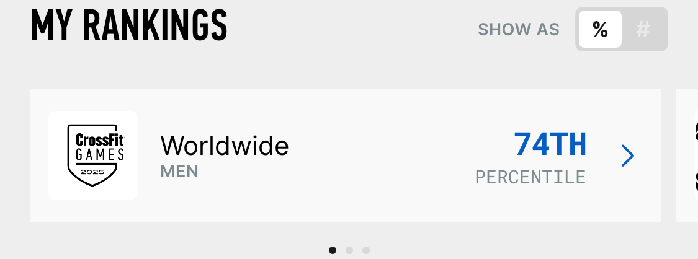

처음으로 크로스핏 오픈 대회에 등록하게 되었다.
매년 열리는 크로스핏 대회로 전세계 사람들을 대상으로 하는 대회이다.
상위 1%는 다음 예선전인 세미 파이널에 진출할 수 있다.

내 운동 능력이 드러내는 것이 두려워 대회에 나가기를 꺼려하였는데 이번에는 달랐다.
객관적 나의 위치를 알고 싶었다.
Rx'd로 대회에 출전했다.

2월 27일 – 3월 17일까지 총 3주에 걸쳐 3개의 WOD(Workout Of the Day)를 수행해야 한다.
이벤트 하나하나가 쉽지 않음의 연속이었다.

## 25.1 WOD

첫번 째 와드는 다음과 같다.
자세한 동작은 [링크](https://games.crossfit.com/workouts/open/2025/1)를 참고하라.

```
As many rounds and reps as possible in 15 minutes of:

3 lateral burpees over the dumbbell
3 dumbbell hang clean-to-overheads
30-foot walking lunge (2 x 15 feet)

*After completing each round, add 3 reps to the burpees and hang clean-to-overheads.

♀ 35-lb (15-kg) dumbbell
♂ 50-lb (22.5-kg) dumbbell
```

22.5kg 덤벨이 왼손기준으로 좀 무겁긴 했다.
그래도 페이스를 꾸준하게 유지할 수 있을 와드 였다.
그나마 가장 할만한 와드였다고 생각한다.

첫번째 측정에서 너무 실수를 많이해서 재측정을 할 수 밖에 없었다.
재측정 때 기록도 늘어 총 209 Reps을 하게 되었다.


## 25.2 WOD

두번 째 와드는 다음과 같다.
자세한 동작은 [링크](https://games.crossfit.com/workouts/open/2025/2)를 참고하라.

```
(22.3 repeat)

For time:

21 pull-ups
42 double-unders
21 thrusters (weight 1)
18 chest-to-bar pull-ups
36 double-unders
18 thrusters (weight 2)
15 bar muscle-ups
30 double-unders
15 thrusters (weight 3)

Time cap: 12 minutes

♀ 65, 75, 85 lb (29, 34, 38 kg)
♂ 95, 115, 135 lb (43, 52, 61 kg)
```

이미 전에 2022년도 3번째 와드인 22.3 repeat 이다.
Pull-Ups, Chest-to-bar Pull-Ups, Bar Muscle-Ups는 어찌되었든 할 수 있을거 같았는데 문제는 Thruster였다.
마지막 무게인 135lb(61kg)은 평소에도 많이 안다뤄봤던 무게였다.

이번 와드도 재측했다.
총 204 Reps를 기록하게 되었다.


## 25.3 WOD

대망의 마지막 와드다.
자세한 동작은 [링크](https://games.crossfit.com/workouts/open/2025/3)를 참고하라.

```
For time:

5 wall walks
50-calorie row
5 wall walks
25 deadlifts
5 wall walks
25 cleans
5 wall walks
25 snatches
5 wall walks
50-calorie row

Time cap: 20 minutes

♀ 155-lb (70-kg) deadlift, 85-lb (38-kg) clean, 65-lb (29-kg) snatch
♂ 225-lb (102-kg) deadlift, 135-lb (61-kg) clean, 95-lb (43-kg) snatch
```

나름 긴 와드에 자신이 있어서 20분 짜리 와드임에 기뻤다.
그런데 페이스 조절에 실패했다.
225lb(102kg) 데드 때 너무 빨리 한 탓에 뒤에 동작들을 페이스대로 가지 못했다.
허리가 아파서 비교적 가볍게 듬에도 불구하고 쉬는 시간이 길어졌다.

비하인드로 와드 측정 때 Slow-Motion으로 찍어서 용량 부족으로 영상이 꺼졌다.
10GB 이상 여유 용량이 있었는데..
동영상 시간을 보니 1시간 30분정도 찍혀있었다.

아무튼 기록은 158 Reps이다.


## 2025 오픈 끝

나한테 부족한 것을 많이 느낀 대회였다.
특히 스트랭스가 많이 부족하다.
스쿼트, 데드리프트, 숄더 프레스를 집중적으로 훈련 해야겠다.

나는 짐네 동작을 좋아해서 항상 풀업 연습, 스트릭 핸드스탠드 푸시업 연습, 링머슬업 연습하고 그랬는데,, 나도 모르게 편식을 하고 있었다.
이제 알았으니 스트랭스 훈련을 하자.

끝으로, 2025년 오픈 최종 성적이다.

**전세계 상위 74% (31,121 of 120,196)**

**아시아 상위 69% (3,348 of 10,937)**

**한국 상위 60% (2,127 of 5,435)**


다음 2026년도 크로스핏 오픈 대회 목표는 한국 1,500명 안에 들고 싶다.
한 해 동안 화이팅 🔥🔥