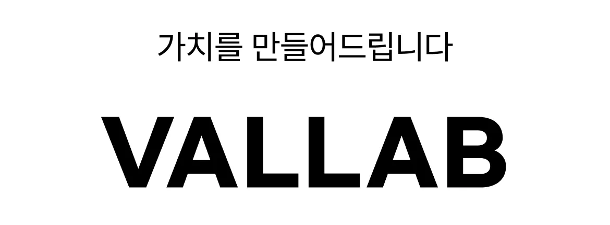
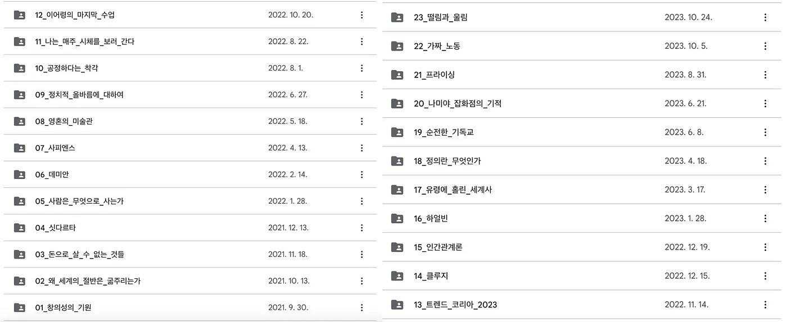

프리랜서 개발자로서 어떻게 일하고 있으며 어떻게 성장해 나가고 있는지 소개합니다.

### 개발자로서의 나

제가 개발하면서 지향하고 있는 핵심가치는 다음과 같습니다.

1. 단순히 서비스를 만드는 것이 아닌 가치를 만든다.
2. 건강한 코드를 작성한다.

**1. 단순히 서비스를 만드는 것이 아닌 가치를 만든다.**

신입 당시 개발을 잘하고자 하는 욕심이 넘쳤습니다.
애플리케이션의 구조를 개선하고 새롭고 효율적인 기술들을 도입하는 것이 개발을 잘하는 것이라고 생각하였습니다.

안드로이드 신입 당시 지금까지 작성된 레거시 코드들을 전부 리팩토링 하고 싶었습니다.
그렇지만 그 당시 회사는 사활이 걸려있는 중요한 시기였습니다.
새로운 기능들을 개발하기에 바쁜 시기였습니다.

그러나 저는 항상 불만 속에 살았던 거 같습니다.
‘왜 개선을 하지 않을까?’, ‘이렇게 돌아가게만 만드는 게 맞는 걸까?’.
지금 생각하면 비즈니스 요소들을 전혀 고려하지 않고 저의 만족감만을 위한 것이었습니다.

단순히 프로그래밍을 잘하는 사람이 아닌 개발 업무를 바탕으로 수익을 낼 수 있는 사람이 되는 것이 더 중요하다는 사실을 이제는 알고 있습니다.
프리랜서로서 일하다 보니 피부로 더 가까이 느끼고 있습니다.
단순히 개발 장인이 되고 싶었던 생각을 버리고 비즈니스를 이해하고 가치를 만들어줄 수 있는 개발자가 되고 싶습니다.

**2. 건강한 코드를 작성한다.**

비즈니스를 고민하며 서비스를 만드는 것은 정말 중요합니다.
연장선상으로 건강한 코드를 짜는 것 또한 중요합니다.
비즈니스를 위해서 말이죠.

좋은 설계와 좋은 코드에 대해 항상 고민합니다.
특히 아키텍처에 관심이 많습니다.
관심사를 분리하여 각 레이어에 역할을 부여하고 역할, 규칙에 따라 개발합니다.

시장 환경에 따라 휙휙 바뀔 수 있는 기획에도 보다 쉽게 대응할 수 있습니다.
이와 같은 이유 때문에 건강한 코드를 작성하는 것은 비즈니스에 도움이 됩니다.

그러나 때에 따라 건강한 코드를 조금 감수하고 개발해야 할 때가 있습니다.
비즈니스와 건강한 코드(좋은 설계 & 코드) 간의 균형을 잘 맞춰가는 것이 잘하는 개발자라고 생각합니다.
항상 두 핵심가치를 생각하며 균형을 맞춰가기 위해 노력합니다.

### 대표자로서의 나

원래 개인 사업자 없이 프리랜서 생활을 했었습니다.
나중에 좀 더 상황이 좋아지면, 안정화되면 그때 사업자를 내도 늦지 않을 거라고 생각했었습니다.

그렇게 작은 프로젝트들을 진행하며 프리랜서 생활을 이어왔습니다.
그러다 운이 좋아 규모가 있는 프로젝트를 할 수 있는 기회가 되었습니다.
서비스에 대해 듣고 기획부터 개발까지 설계 해나갔습니다.
그렇지만 마지막 계약을 하지 못하였습니다.

표면적인 이유는 다른 곳에서 견적을 적게 내서 할 수 없다고 했습니다.
그렇지만 개인적으로는 신뢰도에 문제가 있었다고 생각합니다.
당시 명함도 없었고, 개인 사업자도 아니며, 오직 포트폴리오 하나만 믿고 있었습니다.

너무나 당연한 것들이 없었던 것이였습니다.

결국 다른 일을 찾다가 대학교 다녔을 당시 교수님이셨던 분과 만나게 되었는데 개인사업자의 필요성에 대해 듣게 되었습니다.
내가 계속해서 프리랜서 일을 하려면 개인사업자가 꼭 필요하겠다고 생각하였습니다.

**개인 사업자를 내다**

결국 개인사업자를 내게 되었습니다.
제가 지향하는 첫 번째 핵심가치 문구를 가지고 회사명을 냈습니다.
바로 벨랩(vallab)입니다. Value(가치) + Laboratory(연구소)를 조합한 단어입니다.

지금까지의 결과만을 놓고 보았을 때 정말 개인사업자를 내길 잘한 것 같습니다.
개인사업자가 아니었으면 진행되지 못했을 프로젝트들도 여럿 있었습니다.

또한 정규직 개발자라면 경험해 보지 못할 경험들을 많이 해봅니다.
여기저기 가치가 필요한 곳을 찾아 미팅하고 견적 내는 경험들을 하고 있습니다.

**목표**

현재 대표자로서 저의 목표는 팀을 꾸려보는 것입니다.
기획부터 디자인, 개발, 운영까지 0에서 1을 만드는 경험을 리더로서 해보고 싶습니다.

팀원일 때와는 다른 새로운 경험들을 할 수 있을 것입니다.
그리고 그 경험이 저를 더 성장 시켜 줄것이라 확신합니다.

### 개인 생활

건강한 코드를 지향하듯 건강한 삶을 살아가려고 노력하고 있습니다. 
제 삶을 건강하게 만드는 몇 가지 장치들이 있는데요.

**첫 번째로는 운동입니다.**

저는 매일 평일 새벽 06:30분에 크로스핏을 하고 있습니다.
역도, 체조, 컨디셔닝 등등 여러 방법으로 몸을 단련시키고 있습니다. 
몸도 건강해지지만 제가 더 이점으로 생각하는 부분은 아침 패턴입니다.

아침에 일찍 일어나 운동하고 찬물 샤워를 하고 아침 먹고 영양제를 먹기까지 제 아침 루틴으로 자리 잡혔습니다.
이 모든 게 새벽 운동이라는 장치 덕분입니다. 
크로스핏은 그룹 수업 형태로 진행되기 때문에 늦으면 안 됩니다. 
이러한 강제성이 패턴을 만드는데 큰 몫을 하고 있습니다.

부가적으로 몸도 좋아집니다👍

**두 번째는 독서 모임입니다.**

한 달에 한 번씩 책을 선정하여 읽고 모여서 느낀 점과 의견들을 나누고 있습니다. 
벌써 독서 모임으로만 23권의 책을 읽었습니다.
다양한 카테고리의 책들을 읽을 수 있으며 생각의 범위가 점점 넓어지는 것을 느낍니다.

### 마지막으로

이번 글에서는 제가 프리랜서 개발자로서 어떻게 일하고 있으며 성장하기 위해 어떠한 노력을 하고 있는지 소개하였습니다.

아직 시야도 좁고 많은 것을 경험하지 못하였습니다. 
그렇지만 프리랜서 일을 하기 전과 후를 비교해 보면 많이 성장하였음을 스스로 실감하고 있습니다.

앞으로 더 성장도록 하겠습니다🙏🔥🔥