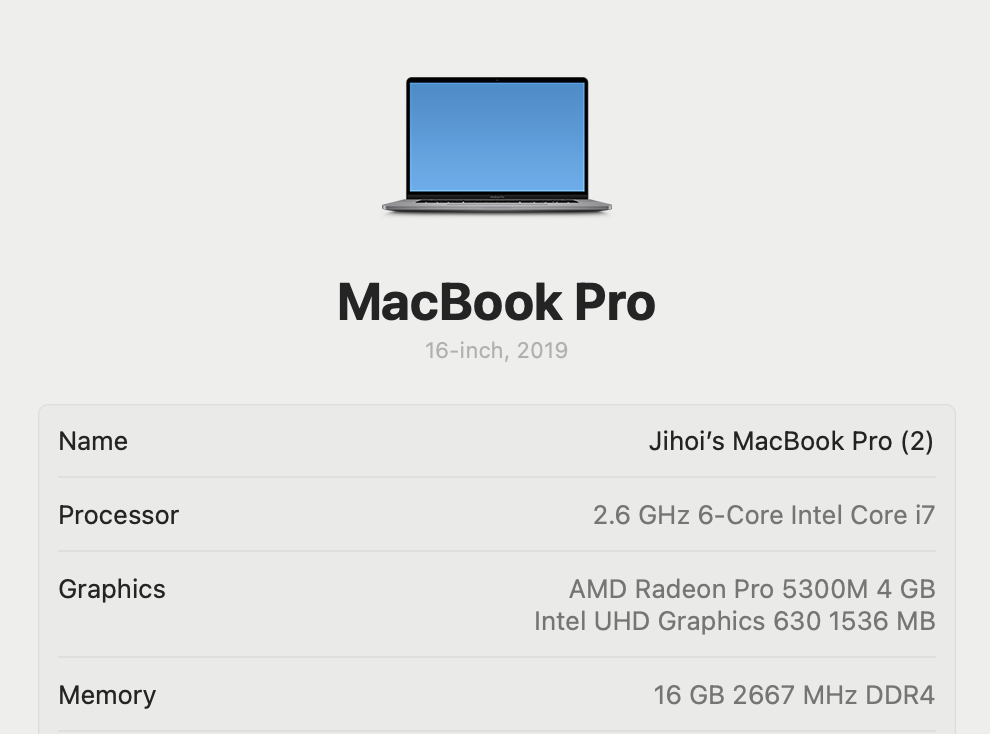

m3칩 맥북이 출시 할 때부터 새로 사고 싶었는데 고민하다 드디어 새로운 맥북 m4칩을 구매하게 되었다.
지금 쓰고 있는 맥북도 나름 나쁘지 않은 스팩이지만 사용하고 있는 프로그램을 모두 쓰기에는 부족하였다.

처음에는 Android Studio IDE만 사용하였다.
그러나 점점 사용하는 툴(IntelliJ, Webstorm, Docker 등)이 많아지니 메모리가 감당하지 못하기 시작했다.
사용하고 있는 IDE를 껐다가 키면 다시 잘 동작했지만 매우 불편했다.

**아쉬웠던 점**

- 성능 저하 이슈
    - 코드를 작성하고 있는데 뒤늦게 화면에 출력
    - 아무것도 안했는데 마우스 포인터가 로딩 아이콘으로 변경
    - 빌드가 너무 오래 걸림
- 용량이 가득 참

맥북도 사용된지 4.5년이 되었고 프리랜서다 보니 내 노트북으로만 작업을 하다 보니까 스팩업이 필요했다.
그리고 마침 m4 사전 할인 중이더라.
이때다 싶었다.

내가 사용하고 싶은 스팩은 메모리 32GB 이상, 1TB 용량에 16인치였다.
얼추 원하는대로 맞추고 가격을 보니 450~500만원대였다.

예산과 맞지 않아 선택과 집중이 필요했다.
일단 메모리 32GB를 사용하려면 칩(프로세서)를 업그레이드 해야만 했다.
어쩔 수 없이 24GB를 선택하게 되었다.
그리고 14인치 + 1TB vs 16인치 + 512GB 선택해야 했다.

보통 나는 카페에서 일을 많이 하기 때문에 화면을 포기할 수 없었다.
그리고 기존에 용량이 많다고 생각해서 막 써서 그렇지 관리하면 충분히 사용할 수 있다고 판단하였다.

그렇게 16인치 + 512GB를 선택했고 쿠팡을 통해 12시간만에 새로운 맥북을 받게 되었다.

**개발 환경 세팅**

이것저것 개발 해야하다보니 [Android Studio](https://developer.android.com/studio?hl=ko)도
필요하고 [WebStorm](https://www.jetbrains.com/webstorm/)도 필요하고 [IntelliJ](https://www.jetbrains.com/idea/)도 필요했다.
그런데 IntelliJ Ultimate에서 내가 원하는 모든 환경을 제공해주는 것을 알게 되었고 구독을 시작하게 되었다.
여러 IDE 켜는 것보다 하나의 IDE만 가지고 개발하는게 더 유리할 것 같다.

이제 불편한 것도 해결했으니 마음껏 개발 해보자.
이번에 산 맥북을 가지고 또 열심히 살아보자!

화이팅🔥🔥
