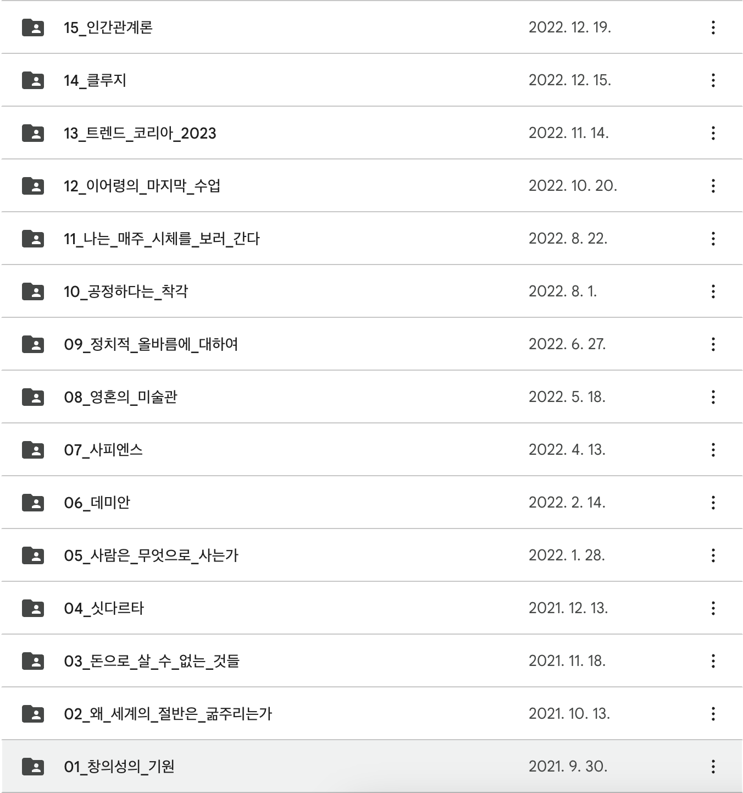

벌써 4년차 개발자가 되었다.
이때 즈음이 되면 모든것을 통달하고 다 알것 같았지만 아직 부족함을 느낀다.
공부해야 될것들은 줄지 않고 더 고민하고 생각해야할 부분들은 점점 더 많아 지는 것 같다.

나는 대부분의 시간을 안드로이드 개발자로서 일을 해왔다.
서버도, 웹 프론트도 공부해보았지만 내가 가장 잘할 수 있는 직무는 안드로이드라고 생각했다.
자세한 나의 개발자 이야기는 다음에 기회되면 이야기 하도록 하겠다.

안드로이드 업무를 하고 있지만 채워지지 않는 목마름이 있었다.
작은 스타트업의 특성상 모바일 개발자는 2명이상 뽑지 않는다.
그러다보니 좋은 코드와 문화에 대해서 고민할 구성원이 없었다.

작은 스타트업의 한계인지, 나의 노력이 부족한건지, 둘 다 해당하는지 모르겠지만 개발의 목마름을 채워 나가야겠다고 항상 생각했다.
그래서 개인 프로젝트도 만들어보고, 최신에 나온 안드로이드 기술들도 공부하면서 개인적으로 많이 성장하는 시간들을 가졌다.

하지만 서버가 없는 안드로이드 프로젝트는 만들 수 있는 서비스의 범위가 작았다.
어쩔 수 없이 서버를 공부하게 되었고 서버를 공부 하다보니 ‘나 서버도 좀 잘 맞을지도?’ 라는 생각이 점점 들기 시작했다.

이렇게 모바일 업무의 특성(?)과 서버에 대한 흥미가 결합해 직무전환이라는 목표를 가지기 시작했다.

### 회사

나는 이번년도 상반기까지 다닌 회사가 있었다.
그 곳에서 안드로이드 일을 하다가 직무전환을 해야겠다고 생각을 하였고 회사쪽에 내가 하고 있는 일에 서버쪽까지 일을 맡아서 하기를 요청했다.
감사하게도 요청에 승낙 해주셨고 2월정도부터 서버쪽 일을 파악하기 시작하였다.

그런데 안드로이드 딱지를 뗄 수가 없었다.
서버쪽 회의도 간간히 참여하고 어떤 업무를 맡게 될 지도 정해졌지만 실제 업무를 할 수 없게 되었고 리뷰에 참여하는 정도로 그쳤다.
조금 더 주도적으로 일 할 수 있는 곳이 내게 필요했다. 그래서 6월정도 퇴사를 결정하게 하게 되었다.

감사하게도 프리랜서로 이 회사와 꾸준히 계약을 맺어 안드로이드 업무를 해주고 있다 🙂

나는 프리랜서 일들을 하며 서버 공부에 열중하였다.
인프라 구축도 해보고 인프라 설계도 해보고 서버 프레임워크에도 익숙해지는 시간들을 가졌다.

9월 다시 프리랜서 일을 구하다가 지금 다니고 있는 스타트업을 만나게 되었다.
정말 감사하게도 내가 원래 하고 있던 안드로이드 업무에 대하여 좋은 평을 해주셨다.
업무 방식, 프로젝트 설계에 대한 접근 방향성, 비지니스에 대한 이해 등등 내 입으로 말하기 부끄럽지만,, 이러한 이야기들을 들으며 좋은 피드백을 받았다.

그동안의 나의 노력들이 인정받는 것 같아서 기분이 좋았다.

프리랜서 계약이 끝날 때 즈음이 되자 ‘정규직으로 전환하는 것이 어떻겠냐?’ 제안을 주셨다.
나는 서버 개발자로도 일하고 싶다고 말했고 서버 & 안드로이드 일을 하는 것으로 제안에 승락하였다.

내가 정규직으로 전환한 이유는 크게 3가지였다.

- 서버 개발자로서의 직무 전환의 기회
- 서버 개발로서 0에서 1을 만드는 작업을 할 수 있는 기회
- 업무 프로세스에 대하여 배울점(추상적인 업무를 구체화 시킬 수 있는 능력을 키울 수 있는 기회, 매주 실적을 보며 한주간 내가 했던 일들을 돌아 볼 수 있는 시스템 등등)

지금은 열심히 서버 개발을 하고 있다. 지금 1차 목표는 ‘Zero to One’을 하는 작업이다.
출시 할 수 있을 정도의 서비스를 만들기 위해 몰입하고 있다.

또한, 파트장이라는 직분을 맡게 되었다.
지금까지 팀원으로서만 일해봤는데 파트장이라니,, 아직도 어떻게 하는건지 잘 모르겠다.
스스로 개발 파트장으로서 어떤 일들을 해야되는지 정의하는 중이다.
내년에는 파트장으로서의 성과, 실적들이 눈에 보이면 좋을 것 같다.

파트장은 아무나 하는 자리가 아니다.
그냥 직분을 주는 것으로 파트장이 되는 것은 아닌 것 같다.
구성원들에게 인정을 받은 후에야 진정한 파트장이 되는 것이라 생각한다.
이런 측면에서 보았을 때 나는 아직 파트장이 아니다.

증명을 해야한다.
파트장으로서, 개발자로서 유의미한 성과들을 내어 구성원들에게 인정 받는 파트장이 되고 싶다.
신뢰도를 쌓고 다른 구성원들을 설득하는 일에 더 힘써야겠다.

### 개인

**운동**

새로운 운동을 접하고 배우기 시작했다. 원래 평소에 운동을 좋아하여 축구, 풋살을 많이 했었다.
그런데 한번 다친 후로 잘 안하게 되었다. 그 대신 자전거, 헬스를 하게 되었는데,, 헬스는 나한테 잘 맞는 운동은 아니였다.
나는 고립보다는 기능성 운동, 동적인 운동을 선호한다.

그러다 우연히 크로스핏이라는 운동을 유튜브로 접하게 되었다.
재밌어 보여 1회 체험을 신청했고 매력을 느껴 등록하였다.
지금은 2개월차 크린이다.
갈 때마다 내 약점을 깨닫는다.

능력치를 육각형으로 놓았을 때 크로스핏은 모든 능력을 밸런스 있게 만들고 그 육각형 크기를 키워나가는 운동이다.
꾸준히 하여 운동 수행 능력이 올라가게 되면 뿌듯할 것 같다.

**독서모임**

독서모임을 운영한지 1년이 넘었다
. 바쁜 일상 속에서 잠시 쉬어 책을 읽고 스스로를 돌아보는 시간을 가지면 좋을 것 같다는 생각이 들었다.
바로 [초대장](https://noiseless-glade-255.notion.site/Me-1ac5366e92ce40c6935ba7dc92b7bfc3?pvs=4)을 만들었고 주변인들에게 초대장을 뿌렸다.
감사하게도 나포함 5명 정도 모여 독서모임을 시작할 수 있었다.

첫모임 날짜가 21년도 10월 9일이였는데 어느덧 2년차가 되었다.
한달도 빠짐없이 지속할 수 있어서 감사했고 모두 내가 원하는 방침대로 잘 참여해주어서 고맙다.

스스로 원하는 것을 찾고 성장시키는 모임으로 계속 지속되길 바란다.

**개인 프로젝트**

개발자로서 많이 성장하고 학습하였지만 개인 서비스를 출시하지는 못하였다.
다 부러졌다.

책을 읽는 사람들을 위한 블로그 플랫폼을 만들고 싶었다.
서비스 특성상 모바일 보다는 웹으로 만들어야 더 유용할 것이라 생각하였다.
책 구절을 쓸 수 있는 기능, 그 외에도 유용한 기능들을 제공하는 서비스를 만들고 싶었지만 글을 쓸 수 있는 에디터를 내가 원하는 대로 바꾸기가 어려웠다.
이걸 해결 할 수 없으면 이 서비스는 메리트가 없다고 생각하였다.
React는 내가 익숙한 플랫폼도 아니였다.
그래서 이 프로젝트는 종료하게 되었다.

그 외에도 서비스를 만들다가 바쁘다는 핑계로 프로젝트를 종료하게 되었다.

### 2023년도는?

**운동**

크린이 탈출(?)이다.
크린이의 기준이 뭔지는 잘 모르겠지만 우리 박스에는 승급제도가 있다.
Rainbow → White → Yellow → Red → Black 이렇게 되어 있다.
나는 레인보우고 한단계 승급하는 것을 목표로 정해보고 싶다.

또 다른 목표는 바디 프로필 찍어보는 것이다.
주변에도 바프를 찍은 사람이 많다.
다들 열심히 노력하여 만든 모습들을 사진에 담아내는 것이 멋있게 느껴졌다.
이번년도에는 내가 도전해보고 싶다.

**개인 프로젝트**

운동 혹은 책읽기와 관련해서 만들어보고 싶은 서비스들이 있었다.
이번 년도에는 짬짬히 시간을 내서 만들어 보고 싶다.
회사를 다니면서 매일 밤 1–2시간씩 라이브 방송하면서 서비스를 만들어내는 것들을 보았다.
대단하다는 생각밖에 안든다.

라이브 방송을 킬 생각은 없지만 매일 조금씩이라도 내 개인 프로젝트를 만드는데에 투자해보고 싶다.

**블로그 포스트**

블로그를 지속적으로 써보고 싶다.
이전에도 여럿 시도해보았다.
그런데 조금만 검색하면 나오는 포스트들을 다시 쓴다는 것에 필요성을 잘 못느끼지 못했다.

기본 개념에 대해서만 쓰기보다는 나만의 경험을 입힌 블로그를 만들고 싶다.
월 1회 정도를 목표로 포스팅을 하고 싶다.
