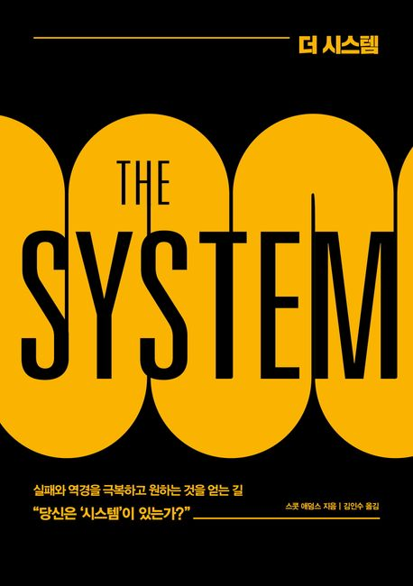

**꾸준하게 지속할 수 있는 힘은 어디에서 올까?**

크로스핏을 시작한지 2년이 넘었다.
아직 부족한 점이 많지만 처음 시작했을 때에 비해 큰 발전을 이루었다.

처음 크로스핏을 시작 했을 때에 정말 잘하고 싶었다.
운동 잘하는 사람이 멋있어 보였다.
바머슬업, 링머슬업, 클린, 스네치, 물구나무 서서 걷기 등.. 동작도 화려하고 드는 무게도 높았다.

나도 멋있는 사람이 되기 위해 무게를 높이고 새로운 기술들을 익히려고 노력했다.
그 때 어깨, 손목, 팔꿈치를 많이 다쳤었다.
기초 근력은 부족한데 난이도 높은 기술들을 익히려고 했던 잘못을 범했기 때문에 당연한 결과였다.

계속되는 부상에 욕심을 버리고 좀 못해도 꾸준하게만 하자 생각하게 되었다.

-----

나는 지금도 주 5-6회 크로스핏을 꾸준히 해오고 있다. 그 힘은 어디에서 올까?

더 시스템이라는 책에서 그 답을 찾았다.

사람들은 보통 뭔가를 시작할 때에 목표를 정하려고 한다.
그런데 더 시스템에서는 이렇게 말한다.

> 패자는 목표를 설정하고 승자는 시스템을 만든다.

나 역시 더 시스템에서 말하는 패자처럼 어려운 기술들을 수행 하는게 목표였다.
그리고 계속되는 실패에 좌절하곤 했었다.
이 책을 접하고 나도 시스템을 만들기 시작했다.

그 때 시작한 것이 새벽 운동이었다.
6시에 매일 일어나 6시반에 운동하는 것이 나의 삶에도 큰 힘이 되었고 크로스핏을 꾸준히 하게하는 원동력이 되었다.

지금은 이미 운동하는 것이 내 삶의 시스템으로 잡혀 오후 운동을 나간다.
무게 치기에는 아무래도 일어나서 바로하는게 힘들다.

꾸준히 하고 싶은게 생겼다면 목표보다는 시스템을 만들어보자.
목표도 중요하지만 그보다 더 중요한건 시스템을 만드는 것이다.
시스템을 만들어서 그 안에 나를 던져두어 보자.
그 시스템이 내 몸과 점점 맞아 갈 것이고 비로소 꾸준함으로 이어나갈 수 있을 것이다.

내 삶에서 시스템이 잘 동작하는 것도 있고 그렇지 않은 부분도 존재한다.
못하고 있는 것들을 어떻게 시스템화 시켜 나갈 수 있을지 고민해 보아야겠다.

훌륭한 사람들이 하고 있는 아침루틴, 생활 패턴이 괜히 있는 것이 아니다.
그 루틴은 나를 꾸준하게 할 것이고 그 꾸준함이 성장하게 할 것이다.
