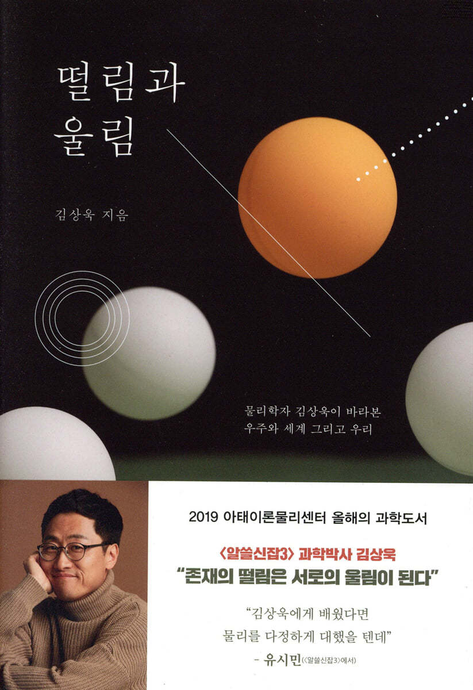

최근 김상욱 물리학자 교수님의 책을 읽었다.
TV 방송에 출연해 강의하는 것을 본 적이 있다.
어떻게 저렇게 말을 잘하시는지, 어렵게만 느꼈던 과학을 저렇게 쉽고 또 몰입할 수 있게 만드는지 김상욱님의 능력에 감탄했었다.

내가 읽은 책은 떨림과 울림이다.
이 책은 나에게 많은 인사이트들을 주었다.

이 책에서 과학은 지식이 아니라 태도라는 점을 강조하고 있다.
이 말은 과학의 가치가 과학적 발견이 가지고 있는 학문적, 경제적 효용가치에만 의미가 있는 것이 아니라 그 법칙에 녹아 있는 철학적 가치에도 의미가 있다는 것이다.

책 속에는 여러 법칙들을 설명하고 있는데 그 법칙들 속에서 저자가 말하는 과학적 태도를 느낄 수 있었다.
몇가지 법칙들에 대해서 소개하고 싶다.

**환원과 창발**

환원주의란 철학에서 복잡하고 높은 단계의 사상이나 개념을 하위 단계의 요소로 세분화하여 명확하게 정의할 수 있다고 주장하는 견해를 뜻한다.
간단히 말해 더욱 더 작은 단위로 쪼개서 무언가를 이해하려고 하는 태도이다.
예를들어 자연의 기본 입자를 연구하는 입자 물리학이나 원자나 전자 등 미시의 세계의 운동을 이해하는 양자역학은 환원적 관점이다.

반면 창발이란 하위 계층엔 없는 특성이나 행동이 상위 계층에서 자발적으로 출현하는 현상을 말한다.
간단히 말해 작은 단위일 때에는 관찰되지 않았던 법칙이 큰 단위에서는 관찰된다는 것이다.
입자의 응집으로 이루어진 물질의 성질을 이해하는 응집 물리학이나 거시 세계의 물체 운동을 이해하는 고전 역학은 창발적 관점이다.

환원은 세상을 이해하기 위해 더욱 더 작은 것을 연구해야한다고 이야기하고 창발은 세상을 이해하기 위해서는 작은 것에서는 나오지 않는 특징을 보기 위해 큰 단위를 연구해야 한다고 한다.

저자는 환원적 관점과 창발적 관점의 차이를 대립이 아닌 상호보완으로 이해하는 지점에서 과학을 하는 태도를 엿볼 수 있다고 한다.

종종 상호보완해야하는 일에 대해서 대립하고 양자택일을 해야하는 것이 당연한 듯 하는 상황들이 있다.
서로 같은 곳을 바라보고 상호보완하는 과학적 태도를 배우자.

**스케일**

과학자들이 무언가를 안다고 하는 것은 일정 범위의 거리나 일정 에너지 영역에서 잘 작동하는 생각이나 이론을 의미한다.
그렇지만 스케일에 대한 기술이 생략되어 있음을 인지해야 한다고 말한다.

내가 아는 범위를 넘어서는 것에 대해서는 모른다고 말하는 것이 과학적 태도라는 것이다.

사람 마다 이해하고 있는 스케일의 범위는 다르다.
누구는 개발을, 누구는 마케팅을, 누구는 디자인을, 누구는 광고를 등등… 너무나 다양한 스케일이 존재한다.
그렇지만 자신의 분야에 대해서 설명할 때에 당연히 알고 있는 상식인 것처럼 이야기하곤 한다.
지식의 저주에 빠져 버린 것이다.

나에게는 상식인 것이 타인에게는 그렇지 않을 수 있고 내가 맞다고 생각한 것이 타인에게는 적용되지 않을 수 있음을 항상 기억하자.

**떨림과 울림**

책의 제목이 말하는 떨림과 울림은 세상을 구성하는 원자와 전자의 진동을 의미한다.
원자와 전자가 진동운동을 하며 떨림을 보내면 그 진동을 통해 울림이 생긴다는 말이다.
이로인해 우리는 듣기도 하고, 보기도 하고, 냄새를 맡기도 하고, 다른사람의 피부를 느끼기도 한다.

여기에서 나는 떨림을 의도로 울림을 받아들이는 자의 태도로 생각했다.
이 세상을 살아가며 사람과의 관계, 일 등등 모든 행위에서 나는 떨림, 즉 의도를 발산하고 있다.
다른 사람이 울림, 즉 태도로 나의 떨림에 리액션 해주기를 바라며 말이다.

또한, 다른 사람도 나에게 의도를 보내고 있다.
어떤 것은 큰 울림으로 받아들이는 반면 미세한 울림으로 받아들이는 것들도 있다.

좋은 떨림을 인지하고 받아드리는, 또한 떨림을 잘 방출할 수 있는 능력을 가지고 싶다.

**마지막으로**

책의 부록에서 인용한 유발 하라리의 사피엔스에서 인간은 의미 없는 우주에 의미를 부여한다고 한다.
의미를 부여하고 사는 존재이니 만큼 각자에게 유의미하게 다가오는 과학적 법칙들이 있을것이다.
우주가 우리에게 보내는 진동과 그것을 이해하려는 인간의 과학하는 태도를 통해 원자 스케일로 이루어진 세계를 인간 스케일의 렌즈로 볼 수 있도록 하는 책이였다.

